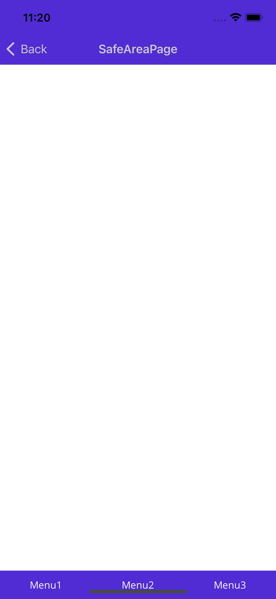
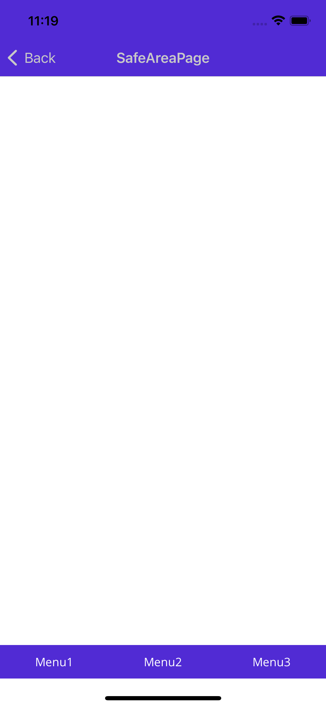
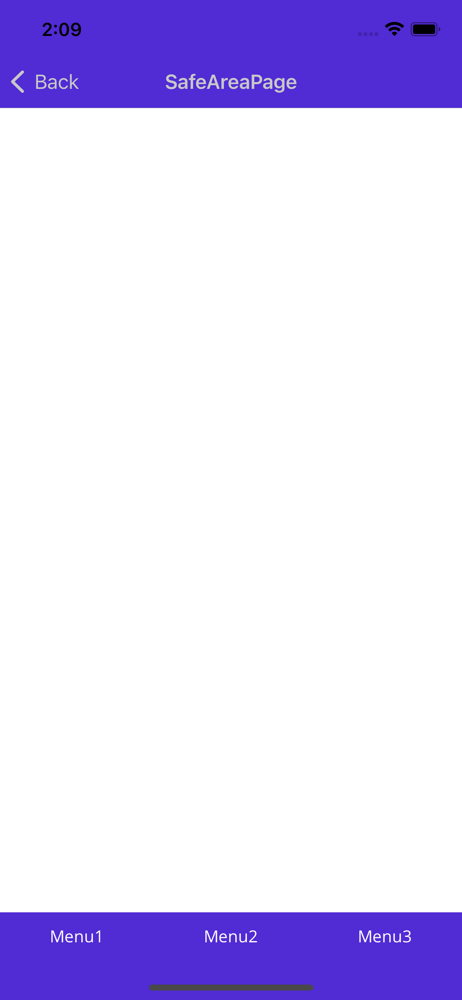

# Entap.Basic.Maui.Core
* Modules
  * [PageManager](#pagemanager)  
  * [DisplaySizeManager](#displaysizemanager)  
* Behaviors
  * [EventTriggerCallMethodBehavior](#eventtriggercallmethodbehavior)
  * [KeyboardOverlappingBehavior](#keyboardoverlappingbehavior)
  * [SizeChangedBehavior](#sizechangedbehavior)
  * [SafeArea](#safearea関連)


## PageManager
ViewModelからのページ遷移をサポートする。

> **Warning**
> * TabbedPageから画面遷移が必要場合は、TabbedPageのChildrenをNavigatioｎPageとすることを推奨する。  
> https://docs.microsoft.com/ja-jp/dotnet/maui/user-interface/pages/tabbedpage#navigate-within-a-tab
> Entap.Basic.Forms.PageManagerでは、SetNavigationMainPageにTabbedPageで遷移が可能であったが  
> maui-android（6.0.300）において、Navigation Barのみ表示され、Childrenに指定したPageが表示されない不具合が発生。  
> （戻るボタンタップ後、アプリを再表示すると画面が表示されることがある）  
  
### 使用説明  
* ページ遷移制御は、デフォルトでは[PageNavigation](/source/Entap.Basic.Maui.Core/Entap.Basic.Maui.Core/Shared/PageManager/PageNavigation/PageNavigation.cs)をするが、[PageManager.SetNavigation()](/source/Entap.Basic.Maui.Core/Entap.Basic.Maui.Core/Shared/PageManager/PageManager.cs#L24)で任意の処理の指定が可能。　　
[PageNavigation](/source/Entap.Basic.Maui.Core/Entap.Basic.Maui.Core/Shared/PageManager/PageNavigation/PageNavigation.cs)の以下のメソッドはオーバライド可能　
    * CreateNavigationPage  
    * CreateClosableNavigationPage  
それ以外の処理を書き換えたい場合は、[IPageNavigation](/source/Entap.Basic.Maui.Core/Entap.Basic.Maui.Core/Shared/PageManager/PageNavigation/IPageNavigation.cs)を継承した処理を実装し指定する。

  
* TabbedPage使用時は、TabbedPageNavigationBehaviorを指定することで  
タブを切り替え時に、PageViewModelのOnEntry(), OnExit()が実行されるようになる。
```xml
<TabbedPage xmlns="http://schemas.microsoft.com/dotnet/2021/maui"
             xmlns:x="http://schemas.microsoft.com/winfx/2009/xaml"
             xmlns:basic="http://entap.co.jp/schemas/basic"
             x:Class="Sample.TabbedNavigationPage"
             x:DataType="local:TabbedNavigationPageViewModel">
    <TabbedPage.Behaviors>
        <basic:TabbedPageNavigationBehavior/>
    </TabbedPage.Behaviors>
```
## DisplaySizeManager
画面サイズ、 NavigationBar、 ステータスバー等のサイズを取得する
### 対象
| Platform | サポート |
| -------- | ------- |
| Android | ✔️ |
| iOS | ✔️ |
| MacCatalyst | ✖️ |
| Tizen | 未確認 |
| WIndows | 未確認 |

## EventTriggerCallMethodBehavior
* 任意のイベント発火時に指定したオブジェクトのメソッドを実行する  
[サンプル](/source/Entap.Basic.Maui.Core/README.md#eventtriggercallmethodbehavior)では、
ボタンクリック時にWebViewのGoBack、GoForwardを実行。  

## KeyboardOverlappingBehavior
* 対象：iOS  
* キーボード表示時に、キーボードの高さ分をView.Margin.Bottomに指定することでViewが隠れるのを防止する。  
※使用方法は[サンプル](/source/Entap.Basic.Maui.Core/Sample/Sample/UI/Pages/KeyboardOverlapping/KeyboardOverlappingPage.xaml)参照。  

## SizeChanged
* VisualElement.SizeChangeイベント発火に、Width/Heightを取得可能。
* SizeChangedCommandを(ICommand<Size>)バインド可能。

## SafeArea関連  
Microsoft.Maui.Controls.PlatformConfiguration.iOSSpecific  
Page.UseSafeAreaを使用すると、画面下部に空白が発生する。  
これを回避するために、SafeAreaを取得しPadding/MarginでSafeAreaを回避する。  
### サンプル画像
| UseSafeArea=False | UseSafeArea=True | Behavior使用時 |
| -------- | ------- | ------- |
|  |   |  |

* GetPageSafeAreaBehavior：Appearingイベントを購読し、SafeAreaを取得する　<br/>
 https://docs.microsoft.com/ja-jp/xamarin/xamarin-forms/platform/ios/page-safe-area-layout
* SafeAreaLayoutBehavior：任意のLayoutに対し、Paddingを使用しSafeAreaを指定する　　
* SafeAreaViewBehavior：任意のViewに対し、Marginを使用しSafeAreaを指定する　　

### 使用例
* GetPageSafeAreaBehaviorでSafeAreaを取得し、SafeAreaLayoutBehaviorで反映
```xml
<?xml version="1.0" encoding="utf-8" ?>
<ContentPage xmlns="http://schemas.microsoft.com/dotnet/2021/maui"
             xmlns:x="http://schemas.microsoft.com/winfx/2009/xaml"
             xmlns:local="clr-namespace:Sample"
             xmlns:basic="http://entap.co.jp/schemas/basic"
             x:Class="Sample.SafeAreaPage"
             x:DataType="local:SafeAreaPageViewModel"
>
    <ContentPage.Behaviors>
        <basic:GetPageSafeAreaBehavior
            x:Name="getPageSafeAreaBehavior"
        />
    </ContentPage.Behaviors>

    <VerticalStackLayout
        VerticalOptions="EndAndExpand"
    >
        <!-- Contents -->

        <!-- Footer -->
        <Grid>
            <Grid.Behaviors>
                <basic:SafeAreaLayoutBehavior
                    PositionFlags="Bottom"
                    SafeArea="{Binding Source={x:Reference getPageSafeAreaBehavior}, Path=SafeArea}"
                />
            </Grid.Behaviors>

            <!-- FooterContents -->
        </Grid>
    </VerticalStackLayout>
</ContentPage>
```
